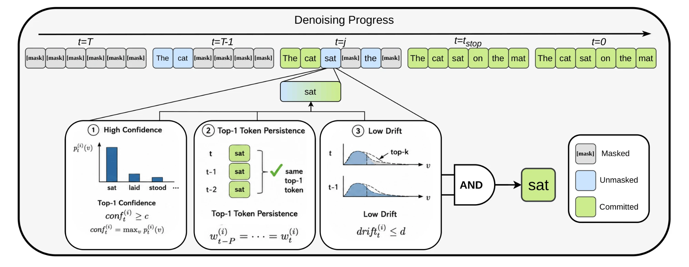

# LESS Is More: Mutual-Stability Sampling for Diffusion Language Models

<p align="center">
  
</p>

A training-free decoding rule for masked diffusion LMs (Dream, LLaDA). It commits a
masked position only when three signals agree — **confidence**, **persistence**
(stable argmax), and low **drift** (top-`K` JS divergence) — cutting denoising steps
at matched quality.

## Install

```bash
pip install -r requirements.txt && pip install -e .
```

## Use

**Dream-7B**

```python
import torch
from transformers import AutoModel, AutoTokenizer
from dream_sampling import diffusion_generate_less

model_path = "Dream-org/Dream-v0-Instruct-7B"
model = AutoModel.from_pretrained(model_path, trust_remote_code=True,
                                  torch_dtype=torch.bfloat16, device_map="auto").eval()
tokenizer = AutoTokenizer.from_pretrained(model_path, trust_remote_code=True)

prompt = tokenizer.apply_chat_template(
    [{"role": "user", "content": "What is the capital of France?"}],
    tokenize=False, add_generation_prompt=True,
)
inputs = tokenizer(prompt, return_tensors="pt").to(model.device)

sequences, stats = diffusion_generate_less(
    model, inputs["input_ids"],
    attention_mask=inputs["attention_mask"],
    max_new_tokens=256, steps=256,
    conf_threshold=0.75, drift_threshold=0.04,
    mask_token_id=tokenizer.mask_token_id,
    model_type="dream",
)
gen = sequences[0, inputs["input_ids"].shape[1]:]
print(tokenizer.decode(gen.tolist(), skip_special_tokens=True))
print(f"steps used: {stats[0]['steps_taken']} / {stats[0]['Tmax']}")
```

**LLaDA-8B**

```python
import torch
from transformers import AutoModel, AutoTokenizer
from llada_sampling import stable_less_decode, LLADA_MASK_TOKEN_ID

model_path = "GSAI-ML/LLaDA-8B-Instruct"
model = AutoModel.from_pretrained(model_path, trust_remote_code=True,
                                  torch_dtype=torch.bfloat16, device_map="auto").eval()
tokenizer = AutoTokenizer.from_pretrained(model_path, trust_remote_code=True)

inputs = tokenizer.apply_chat_template(
    [{"role": "user", "content": "What is the capital of France?"}],
    add_generation_prompt=True, tokenize=True, return_tensors="pt", return_dict=True,
).to(model.device)

out, used_steps = stable_less_decode(
    model, tokenizer, inputs["input_ids"],
    gen_length=256, steps=256, block_length=32,
    conf_threshold=0.75, drift_threshold=0.04,
    mask_id=LLADA_MASK_TOKEN_ID,
)
gen = out[0, inputs["input_ids"].shape[1]:]
print(tokenizer.decode(gen.tolist(), skip_special_tokens=True))
```

Runnable LESS-vs-vanilla comparisons:

```bash
python examples/dream_less_vs_base.py
python examples/llada_less_vs_base.py
```

<!-- ## Citation

```bibtex

``` -->
